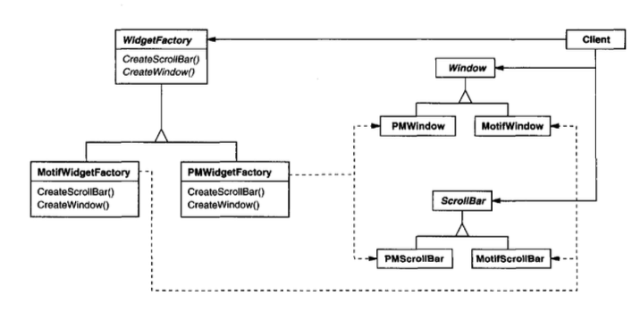

# Abstract Factory (Creación de Objetos)

## Intención
Proveer una interface para la creación de familias de parientes o objetos dependientes sin especificar sus clases concretas.

## También conocida como
Kit

## Motivación
Considerar un kit de herramientas(toolkit) de interfaz de usuario que soporta multiples estándares de `look-and-feel` como Motif(Motif es una biblioteca para la creación de entornos gráficos bajo X Window System) y Presentation Manager(Presentation Manager (PM) es la interfaz gráfica de usuario (GUI) que IBM y Microsoft presentaron en la versión 1.1 de su sistema operativo OS/2 en 1988). Diferentes `look-and-feels` definen diferentes apariencias y comportamientos para los `widgets` de la interfaz de usuario como barras de scroll, ventana, y botones. Para ser portable a través de estándares look-and-feel, una aplicación no debe hacer hard-code de sus widgets para un look-and-feel particular. Instanciando clases de widgets con un look-and-feel especifico a lo largo de la aplicación hace muy difícil cambiar luego de look-and-feel.

Podemos solventar este problema definiendo una clase WidgetFactory abstracta que declara una interface para crear cada tipo básico de widget. También hay una clase abstracta para cada tipo de widget, y subclases concretas que implementan widgets para específicos estándares de look-and-feel. la interface de WidgetFactory tiene una operación que retorna un nuevo objeto widget para cada clase abstracta de widget. Los clientes llaman estas operaciones para obtener instancias de widget, pero los clientes no son conscientes de que clases concretas están usando. Por lo tanto esos clientes se mantienen independientes del look-and-feel prevaleciente. 



Existe una subclase concreta de WidgetFactory para cada estándar de look-and-feel. Cada subclase implementa las operaciones para crear los widgets apropiados para el look-and-feel. Por ejemplo, la operación `CreateScrollBar` en el `MotifWidgetFactory` instancia y retorna un Motif scroll bar, mientras la operación correspondiente en el PMWidgetFactory retorna un scroll bar para Presentation Manager. Los Clientes crean los widgets solo a través de la interface WidgetFactory y no tienen conocimiento de las clases que implementan los widgets para un particular look and feel.

* **AbstractFactory** (Widget Factory)
  - Declara una interface para operaciones que crean objetos de productos abstractos.
* **ConcreteFactory** (MotifWidgetFactory, PMWidgetFactory)
  - implementa las operaciones para crear objetos de producto concretos.
* **AbstractProduct** (Window,ScrollBar)
  - Declara una interface para un tipo de objeto de producto.
* **ConcreteProduct** (MotifWindow,MotifScrollBar)
  - Define un objeto de producto para ser creado por la correspondiente ConcreteFactory.
  - Implementa la interface AbstractProduct.
* **Client**
  - Usa solo interfaces declaradas por clases AbstractFactory y AbstractProduct.

## Colaboraciones
* Normalmente una única instancia de una clase de ConcreteFactory crea objetos de producto que tienen una implementación particular. Para crear diferentes objetos de producto,los clientes deben usar diferentes ConcreteFactory.

* AbstractFactory delega la creación de objetos de producto a su subclase ConcreteFactory.

## Consecuencias
El patrón AbstractFactory tiene los siguientes beneficios y riesgos:
1. *Aísla las clases concretas*. El patrón AbstractFactory ayuda a controlar los objetos de clase que la aplicación crea. Puesto que una factory encapsula la responsabilidad y el proceso de crear objetos de producto, este aísla los clientes de la implementación de clases. Los clientes manipulan instancias a través de sus interfaces abstractas. Los nombres de las clases de producto son aislados en la implementación de la ConcreteFactory; ellas no aparecen en el código del cliente.
2. *Facilita el intercambio de familias de productos*.
La clase de una ConcreteFactory aparece una única vez en la aplicación, la cual seria donde es instanciada. Esto hace mas fácil cambiar una ConcreteFactory que una aplicación usa. La aplicación puede usar diferentes configuraciones de productos simplemente cambiando la ConcreteFactory. Ya que un abstract factory crea una familia completa de productos, toda la familia de productos cambian una única vez. En el ejemplo de interfaz de usuario, Podemos cambiar de widgets  Motif a widgets de Presentation Manager simplemente cambiando los correspondientes objetos factory y recreando la interfaz.
3. *Promueve consistencia entre productos*. Cuando los objetos de producto en una familia son diseñados para trabajar juntos, es importante que una aplicación use objetos de solo una familia al tiempo. AbstractFactory hace que sea mas fácil de reforzarlo.
4. *Soportar nuevos tipos de productos es difícil*. Extender abstract factories para producir nuevos tipos de productos no es fácil. Esto sucede porque la interface de AbstractFactory acopla el conjunto de productos que pueden ser creados. Soportar nuevos tipos de productos requiere extender la interface de factory, lo cual involucra cambiar la clase AbstractFactory y todas sus subclases.  Se discute una solución a este problema en la sección de implementación.

## Implementación
Estas son algunas técnicas útiles para implementar el patrón AbstractFactory. 
1. *Factories como singletons*. Una aplicación típicamente necesita solo una instancia de una ConcreteFactory por familia de producto. Entonces usualmente es mejor implementarla como una Singleton.
2. *Creando los productos*. AbstractFactory solo declara una *interface* para crear productos. Depende de las subclases  de ConcreteProduct crear los productos. El camino mas común  para hacerlo es definir un FactoryMethod para cada product. Si bien esta implementación es simple, requiere una nueva subclase de concrete factory para cada familia de productos, incluso si las familias de productos difieren ligeramente.
Si es posible que tengamos muchas familias de productos, la concrete factory puede implementarse usando el patron Prototype. La concrete factory es inicializada con una instancia prototipo. El enfoque Prototype-based elimina la necesidad de una nueva clase concrete factory para cada nueva familia de productos.

A continuación se presenta una forma de implementar una factory Prototype-based en Smalltalk. El concrete factory almacena los prototipos a ser clonados en un diccionario llamado partCatalog. El método `make:` recupera el prototipo y lo clona:

```smalltalk
make: partName
    ^ (partCatalog at: partName) copy
```

La concrete factory tiene un método para agregar partes al catalogo.
```smalltalk
addPart: partTemplate named: partName
    partCatalog at: partName put: partTemplate
```
Los Prototypes son agregados a la factory identificándolos con un símbolo:
```smalltalk
aFactory addPart: aPrototype named: #ACMEWidget
```
Una variación sobre el enfoque Prototype-based es posible en lenguajes que tratan sus clases como objetos first-class(Smalltalk y Objective C, por ejemplo). Podemos pensar en una clase en estos lenguajes como una factory deteriorada que crea sólo un tipo de producto. Podemos almacenar clases dentro de una concrete factory que crea varios concrete productos en variables, muy parecido a los prototype.
Estas clases crean nuevas instancias en nombre de la concrete factory. Se define una nueva factory inicializando una instancia de una concrete factory con *clases* de productos en lugar de subclases. Este enfoque toma ventaja  de las características del lenguaje, Mientras que el enfoque netamente Prototype-based es independiente del lenguaje.
Como el Prototype-based factory en Smalltalk discutido, la versión class-based tendrá una única instancia de variable `partCatalog`, la cual es un diccionario cuya key es el nombre de la parte. En lugar de almacenar prototipos a ser clonados, `partCatalog` almacena las de los productos. El método `make:` ahora luce así:
```smalltalk
make: partName
    ^ (partCatalog at: partName) new
```
3. *Definiendo factories extensibles*. Usualmente AbstractFactory define una diferente operación para cada tipo de producto que puede producir. Los tipos de productos son codificados en las firmas de las operaciones. Agregar un nuevo tipo de producto requiere cambiar la interface AbstractFactory y todos sus dependientes.
Un diseño mas flexible pero menos seguro es agregar un parámetro a las operaciones que crean objetos. Este parámetro especifica el tipo de objeto a ser creado. Puede ser un identificador de clase, un integer, un string, o cualquier cosa que identifique el tipo de producto. La realidad con este enfoque, AbstractFactory solo necesita una sola operación "Make" con un parámetro indicando el tipo de objeto de producto a ser creado. Esto es una técnica usada en Prototype- y las factories abstractas class-based discutidas al inicio.

Esa variación  es mas fácil de usar en un lenguaje dinamicamente tipados como SmallTalk  que en uno de tipado estático como C++. Podemos usarlo en C++ o cuando el cliente que los solicitó puede forzar de forma segura los objetos del producto al tipo correcto. La sección implementación de Factory Method muestra como implementar cosas como operaciones parametrizadas en C++.

Pero incluso cuando no es necesitada coerción, sigue existiendo un problema inherente: Todos los productos son retornados al cliente con la misa interface abstracta como tipo de retorno dado. El cliente no va poder diferenciar o hacer seguras suposiciones acerca de las clases del producto. Si los clientes necesitan ejecutar operaciones especificas de subclases, ellos no podrán acceder a estas a traves de la interface. Aunque el cliente puede ejecutar downcast(e.g., con `dynamic_cast` in C++) lo cual no es factible o seguro, porque el downcast puede fallar. Es el clásico trade-off para una interface altamente flexible y extensible. 

## Código de Ejemplo
Vamos a aplicar el patron Abstract Factory al crear los laberintos que discutimos en el inicio del capitulo.

la clase `MazeFactory` puede crear componentes de laberintos. Esta construye habitaciones, muros, y puertas entre habitaciones. Esta podría usarse por un programa que lee planos de laberintos de un archivo y construir el laberinto correspondiente. O esta podría ser usada por un programa que construye laberintos aleatoriamente. Los programas que construyen laberintos toman la `MazeFactory` como un argumento entonces el programador puede especificar las clases de habitaciones, muros, y puertas a construir.

```swift
class MazeFactory {
    func makeMaze() -> Maze {
        return Maze()
    }

    func makeWall() -> Wall {
        return Wall()
    }

    func makeRoom(_ roomNo: Int) -> Room {
        return Room(roomNo: roomNo)
    }

    func makeDoor(r1: Room, r2: Room) -> Door {
        return Door(room1: r1, room2: r2)
    }
}
```
Recordemos que la función miembro `CreateMaze` descrita anteriormente en `creational-pattern`, construye un pequeño laberinto que consiste de 2 habitaciones con un puerta entre ellas. Esa función `CreateMaze` acopla los nombres de clases, dificultando el crear laberintos con componentes diferentes.

Aquí se presenta una versión de `CreateMaze` que ajusta esa deficiencia recibiendo `MazeFactory` como un parámetro.

```swift
func createMaze(factory: MazeFactory) -> Maze {
    let aMaze = factory.makeMaze()
    let r1 = factory.makeRoom(1)
    let r2 = factory.makeRoom(2)
    let aDoor = factory.makeDoor(r1: r1, r2: r2)

    aMaze.addRoom(room: r1)
    aMaze.addRoom(room: r2)

    r1.setSide(.north, factory.makeWall())
    r1.setSide(.east, aDoor)
    r1.setSide(.south, factory.makeWall())
    r1.setSide(.west, factory.makeWall())

    r2.setSide(.north, factory.makeWall())
    r2.setSide(.east, factory.makeWall())
    r2.setSide(.south, factory.makeWall())
    r2.setSide(.west, aDoor)

    return aMaze
}
```
Podemos crear `EnchantedMazeFactory`, una factory de laberintos encantados, creando una sub class de `MazeFactory`. `EnchantedMazeFactory` anulará diferentes funciones y retornará diferentes sub clases de `Room`, `Wall`, etc.

```swift
class EnchantedMazeFactory: MazeFactory {
    private let castSpell = Spell(magicWords: "Abracadabra")
    
    override func makeRoom(_ roomNo: Int) -> Room {
        return EnchantedRoom(roomNo: roomNo, spell: castSpell)
    }
    
    override func makeDoor(r1: Room, r2: Room) -> Door {
        return DoorNeedingSpell(r1, r2)
    }
}
```

```swift 
class EnchantedRoom: Room {
    
    let spell: Spell
    init(roomNo: Int, spell: Spell) {
        self.spell = spell
        super.init(roomNo: roomNo)
    }   
}

class DoorNeedingSpell: Door {
    
    private var spell:Spell?
    
    func castSpell(spell:Spell) {
        self.spell = spell
    }
    
    override func open(player:Player) {
        guard spell != nil else {
            print("This door is enchanted and need a spell")
            return
        }
        
        guard let otherSideRoom = otherSideFrom(room: player.location) as? EnchantedRoom else {
            return
        }
        
        guard otherSideRoom.spell == spell else {
            print("Oops!! thats not the correct spell")
            return
        }
        
        super.open(player: player)
    }
}
```
Ahora supongamos que queremos crear un juego de laberinto en la cual una habitación puede tener una bomba dentro de ella. Si la bomba estalla, esta dañara los muros(al menos). Podemos crear una subclass de `Room` manteniendo seguimiento  si la habitación tiene una bomba dentro y si la bomba ha estallado. También necesitaremos una subclass de `Wall` para dar seguimiento del daño hecho a la pared. Llamaremos a estas clases `RoomWithABomb` y `BombedWall`.

La última clase que definimos es `BombMazeFactory`, una subclass de `MazeFactory` que se asegura que los muros son clases `RoomWithABomb`. `BombedMazeFactory` solo necesita anular dos funciones.

 ```swift
 class BombedMazeFactory: MazeFactory {
    
    override func makeWall() -> Wall {
        return BombedWall()
    }
    
    override func makeRoom(_ roomNo: Int) -> Room {
        return RoomWithABomb(roomNo: roomNo)
    }
}

class BombedWall: Wall {   
    var damagePercentage:Float = 0
}

class RoomWithABomb: Room {
    var bombHasGoneOff = false
}
```


Para construir un laberinto sencillo  que contenga bombas, simplemente llamamos `CreateMaze` con una `BombedMazeFactory`.

```swift
    let game = MazeGame()
    let bombedMazeFactory = BombedMazeFactory()
    let maze = game.createMaze(factory: bombedMazeFactory)
```

`CreateMaze` puede tomar una instancia de `EnchantedMazeFactory` igual de bien para construir laberintos encantados.

Debemos entender que `MazeFactory` es solo una colección de factory methods. Este es el camino mas común para implementar el patrón AbstractFactory. También notar que `MazeFactory` no es una clase abstracta; por lo tanto actúa com `AbstractFactory` y `ConcreteFactory`. Esto es otra implementación común para aplicaciones simples de el patrón AbstractFactory. Ya ue `MazeFactory` es una clase concreta que consiste enteramente de factory methods, Es fácil crear una nueva MazeFactory creando una subclass y sobrescribiendo las operaciones que necesita cambiar.

`CreateMaze` usa la operación `SetSide` en habitaciones para especificar sus lados. Si esta crea las habitaciones con una `BombedMazeFactory`, luego el laberinto estará formado por objetos `RoomWithABomb` lados con `BombedWall`. Si `RoomWithABomb` tiene que acceder a un miembro de subclase especifica, tendrá que hacer cast de una referencia de sus muros de `Wall` a `BombedWall`. Este down-casting será tan seguro como el argumento sea en realidad un `BombedWall`, lo cual garantiza a ser cierto si los muros son construidos solamente con una `BombedMazeFactory`.

Los lenguajes *Dynamically typed* como Smalltalk no requieren down-casting, por supuesto, pero podrían producir errores en run-time  si encuentran un `Wall` donde esperan una *subclass* de `Wall`. El uso de AbstractFactory para construir muros ayuda a prevenir estos errores de tiempo de ejecución al garantizar que solo se puedan crear ciertos tipos de muros.

Consideremos una versión en Smalltalk de `MazeFactory`, con una sola operación `make` que toma los tipos de objeto a construir como parámetro. Ademas, la factory concreta almacena las clases de productos que crea.

Primero, vamos a escribir el equivalente de `CreateMaze` en SmallTalk:
```smalltalk
CreateMaze: aFactory
| room1 room2 aDoor |
room1 := (aFactory make: #room) number: 1.
room2 := (aFactory make: #room) number: 2.
aDoor := (aFactory make: #door) from: room1 to: room2.
room1 atSide: #north put: (aFactory make: #wall).
room1 atSide: #east put: aDoor.
room1 atSide: #south put: (aFactory make: #wall).
room1 atSide: #west put: (aFactory make: #wall).
room2 atSide: #north put: (aFactory make: #wall).
room2 atSide: #east put: (aFactory make: #wall).
room2 atSide: #south put: (aFactory make: #wall).
room2 atSide: #west put: aDoor.
^ Maze new addRoom: room1; addRoom: room2; yourself
```

Como discutimos en la sección de implementación  `MazeFactory` necesita solo una instancia de la variable `partCatalog` para proveer un diccionario cuya key es la clase del componente. También tener en cuenta como implementamos el método `make:`:

```smalltalk
make: partName
    ^ (partCatalog at: partName) new
```

Ahora podemos crear una `MazeFactory` y usarla para implementar `createMaze`. Crearemos la factory usando un método `createMazeFactory` de la clase `MazeGame`.

```smalltalk
createMazeFactory
    ^ (MazeFactory new
        addPart: Wall named: #wall;
        addPart: Room named: #room;
        addPart: Door named: #door;
        yourself)
```

Una `BombedMazeFactory` or una `EnchantedMazeFactory` es creada por asociación de diferentes clases con las keys. Por ejemplo, una `EnchantedMazeFactory` puede se creada de la siguiente manera:


```smalltalk
createMazeFactory
    ^ (MazeFactory new
        addPart: Wall named: #wall;
        addPart: EnchantedRoom named: #room;
        addPart: DoorNeedingSpell named: #door;
        yourself)
```


## Usos Conocidos
En InterViews se usa el sufijo "Kit" [Lin92] para denotar clases  AbstractFactory. Lo cual corresponde a factories abstractas WidgetKit y DialogKit para generar objetos de look–and-feel específicos. En estas InterViews también se incluye LayoutKit que genera  diferentes composiciones de objetos dependiendo de el layout deseado. Por ejemplo, un Layout que es conceptualmente horizontal podría requerir diferentes composiciones de objetos dependiendo de la orientación del documento(Portrait o Landscape).

ET++ [WGM88] usa el patrón AbstractFactory para alcanzar diferentes potabilidades para sistemas windows (X Windows y SunView, por ejemplo). La clase base WindowSystem define la interface para crear objetos que representan recursos del window system(MakeWindow, MakeFont, MakeColor, por ejemplo). Subclases concretas implementan las interfaces para un especifico window system.
En run-time, ET++ crea una instancia de una concreta subclase de WindowSystem que crea concretos objetos de recursos del sistema.

## Patrones Relacionados
las clases AbstractFactory son usualmente implementadas con FactoryMethod, pero también pueden ser usados con Prototype.

Una concrete factory usualmente un singleton.