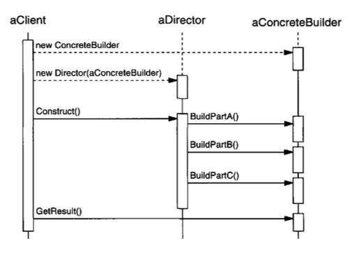

# Builder (Creación de Objetos)

## Objetivo
Separar la construcción de un objeto complejo de su representación, así el mismo proceso de construcción puede crear diferentes  representaciones. 

## Aplicabilidad
Usar el patron Builder cuando

* El algoritmo para crear un objeto complejo debe ser independiente de las partes que conforman el objeto y de cómo se ensamblan.
* El proceso de construcción debe permitir diferentes representaciones para el objeto que se está construyendo. 

## Estructura


## Participantes
* **Builder**
  - Especifica una interface Abstracta para crear partes de un producto.
* **ConcreteBuilder**
  - Construye y ensambla partes del producto mediante implementación de la interface del Builder.
  - Define y realiza seguimiento de la representación que el mismo crea.
  - Provee una interface para obtener el producto.
* **Director**
  - Construye un objeto usando la Builder interface.
*  **Product**
   - Representa el objeto complejo en construcción, ConcreteBuilder construye la representación interna del producto y define el proceso por el que se ensambla.
   - Incluye clases que definen las partes que constituye, incluyendo interfaces para ensamblar las partes en el resultado final.

## Colaboraciones
  * El cliente crea el objeto Director y lo configura con el objeto Builder deseado.
  * El Director notifica al builder cada vez que una parte  del producto debe construirse.
  * el Builder gestiona las solicitudes del director y agrega las partes del producto.
  * El cliente recibe el producto del builder.

El siguiente diagrama de interacción ilustra como un Builder y Director cooperan con un Cliente.



## Practica en Swift

* Builder
 ```swift
 // En swift no existen las clases abstractas por lo cual se puede usar para este caso un protocolo
 // el problema de los protocolos es que nos obligan a sobrescribir todas las propiedades
 protocol TextConverter {
    func convertText(text:NSAttributedString)
 } 

 // Para este caso yo utilicé Herencia básica para no estar obligado a sobrescribir funciones que no se utilicen
class TextConverter {
    func convertText(text:NSAttributedString) { }
}
```
* Concrete Builders
 ```swift
 // Creé dos builders en concreto una para la conversión de RTF a texto ascii y otro para RTF a una representación
 // en SwiftUI.Text
 class ASCIIConverter: TextConverter {
    
    private var asciiText = String()
    
    override func convertText(text: NSAttributedString) {
        do {
            asciiText = try String(contentsOfFile: text.string, encoding: .ascii)
        } catch {
            print("Error to covert to ascii")
        }
    }
    
    func getASCIIText() -> String {
        return asciiText
    }
}
// Text Representation
class SwiftUITextConverter: TextConverter {
    private var suText = Text(String())
    
    override func convertText(text: NSAttributedString) {
        let attributed = AttributedString(text)
        suText = Text(attributed)
    }
    
    func getText() -> Text {
        return suText
    }
}
```

* Director
```swift
// Este director en concreto es para leer un archivo RTF en el bundle de a app
class RTFReader {
    
    let converter:TextConverter
    init(converter: TextConverter) {
        self.converter = converter
    }
    
    func parseRTF(forResource resource: String) {
        if let rtfPath = Bundle.main.url(forResource: resource, withExtension: "rtf") {
            do {
                let attributedString = try NSAttributedString(url: rtfPath, options: [NSAttributedString.DocumentReadingOptionKey.documentType: NSAttributedString.DocumentType.rtf], documentAttributes: nil)
                converter.convertText(text: attributedString)
            } catch {
                print("\(error.localizedDescription)")
            }
        }
    }
}
```

* Client
```swift
// El cliente en este caso es la App de SwiftUI
var body: some Scene {
    WindowGroup {
        VStack{
            makeText()
        }
    }
}
    
func makeText() -> Text {
    // Crea el ConcreteBuilder deseado
    let converter = SwiftUITextConverter()
    // Crea el Director y le pasa el Builder
    let reader = RTFReader(converter: converter)
    // El cliente avisa a Director para empezar la construcción
    reader.parseRTF(forResource: "document")
    // El cliente recibe el producto
    return converter.getText()
}
```


## Consecuencias
Estas son algunas de las consecuencias del patron Builder:
  1. *Permite variar una representación interna del producto.* El objeto Builder provee el director con una interface abstracta para construir el producto. La interface permite al builder ocultar la representación y la estructura interna de el producto. Este también  oculta como el producto es ensamblado. Porque el producto es construido a través  una interface abstracta, Todo lo que se debe hacer para cambiar la representación interna del producto es definir un nuevo tipo de Builder.
  2. *Aísla el código para la construcción y representación.* El patron builder mejora la "modularidad" mediante la encapsulación  de la forma en que un objeto complejo es construido y representado. Los clientes no necesitan saber nada acerca de las clases que definen la estructura interna del producto; Tales clases no aparecen en la interface del Builder.
  Cada ConcreteBuilder contiene todo el código para crear y ensamblar un particular tipo de producto. El código es escrito una vez, luego diferentes Directors pueden reutilizarlo  para construir variantes del producto con las mismas partes.
  3. .*Te da un control más preciso sobre el proceso de construcción.* A diferencia de patrones de construcción que construyen productos en un solo llamado, el patron Builder construye paso a paso bajo e control de del Director. Solo cuando el producto es finalizado el director lo recupera del constructor. Esto permite un control preciso sobre el proceso de construcción y consecuentemente de la estructura interna del producto resultante.

## Implementación
Generalmente existe una clase builder abstracta que define una operación para cada componente que la capa de Director puede solicitar crear. Las operaciones no hacen algo por defecto. Una clase ConcreteBuilder sobrescribe operaciones para componentes ya que se interesa en la creación.

Estas son algunos errores en la implementación a considerar:

1. *Interface de ensamble y construcción.* los Builders construyen sus productos  paso a paso. Por lo tanto la interface de la clase Builder debe ser lo suficientemente general  para permitir la construcción de productos de todos los tipos de ConcreteBuilder.
Un error clave en ese diseño referente al modelo de construcción y ensamblado. Un modelo donde los resultados de solicitudes de construcción simplemente  dependen del producto es normalmente suficiente pero algunas veces se puede necesitar acceder a partes del producto construido tempranamente. En el siguiente ejemplo de laberinto(Maze example) se presenta en ejemplo de código, el MazeBuilder interface permite agregar una puerta(door) entre los cuartos existentes. Las estructuras de árbol son otro ejemplo de construcciones de abajo hacia arriba es decir se comienza de las partes mas pequeñas o elementos individuales y se construye la estructura mas completa gradualmente.

2. *¿Por qué no hay clases abstractas para productos?* En un caso común, los productos producidos por los builders en concreto difieren tanto en su representación que hay poca ganancia al dar a diferentes productos una clase principal en común.
3. *Métodos vacías por defecto en el Builder* En C++ los métodos son intencionalmente declarados como miembros y no como virtual methods(funciones abstractas) algo similar al ejemplo de la clase TextConverter en swift, la cual implementa funciones vacías, permitiendo a los clientes anular(override) sólo las operaciones que les interesan.

## Código Ejemplo
Definiremos una variante para la función miembro CreateMaze que toma un builder de la clase MazeBuilder como un argumento.

La clase MazeBuilder define la siguiente clase para construir laberintos:

```swift
// Nótese que estoy usando una clase en lugar de un protocol de swift
// En swift no existe las clases abstractas por lo que usar un protocol
// nos obligaría a sobrescribir todas las siguientes funciones.
class MazeBuilder {
    func buildMaze(){ }
    func buildRoom(room:Int){ }
    func buildDoor(roomFrom: Int, roomTo:Int){ }
    func getMaze() -> Maze {
        return Maze()
    }
}
```
Esta clase puede crear tres cosas: (1) El laberinto, (2) habitaciones con un número particular, (3) puertas entre cuartos enumerados. la operación `GetMaze` retorna el maze al cliente. Las subclases de `MazeBuilder` anularan esta operación para retornar el laberinto que construyen. 

Todos las operaciones maze-building de `MazeBuilder` hacen nada por defecto. No están declaradas puramente virtuales para permitir a las clases derivadas anular solo esos métodos en los cuales están interesadas.

Dado una `MazeBuilder` interface(en nuestro caso entiéndase como clase)  podemos cambiar la función miembro `CreateMaze` para tomar este builder como parámetro.

```swift
func createMaze(builder: MazeBuilder) -> Maze {
    builder.buildMaze()
    builder.buildRoom(room: 1)
    builder.buildRoom(room: 2)
    builder.buildDoor(roomFrom: 1, roomTo: 2)
    
    return builder.getMaze()
}
```
Comparar esta versión de `CreateMaze` con la original. Nótese que el builder oculta  la representación interna de Maze, las clases que definen  habitaciones, puertas y muros, y cómo estas partes son ensambladas para completar el laberinto final. Alguien puede suponer que existen clases para representar habitaciones y puertas, pero no hay indicios para las muros. Esto hace mas fácil de cambiar la forma en que un laberinto es representado, ya que ninguno de los clientes de `MazeBuilder` tiene que ser cambiado.

Como los otros patrones de creación, el patron Builder encapsula cómo los objetos son creados, en este caso a través  de la interface `MazeBuilder`. Esto quiere decir que podemos reutilizar `MazeBuilder` para construir diferentes tipos de laberintos. La operación `CreateComplexMaze` nos da un ejemplo.

```swift
func createComplexMaze(builder: MazeBuilder) -> Maze {
    builder.buildMaze()
    builder.buildRoom(room: 1)
    // ...
    builder.buildRoom(room: 1001)
    
    
    return builder.getMaze()
}
```

Notar que `MazeBuilder` no crea laberintos por su cuenta. Su principal propósito es solo definir una interface para crear laberintos. Este define ante todo implementaciones vacías por conveniencia. Las subclases de `MazeBuilder` realizan realmente el trabajo.

La subclass `StandardMazeBuilder` es una implementación que construye laberintos simples. Esta rastrea el laberinto que está construyendo en la variable `_currentMaze`

```swift
class StandardMazeBuilder: MazeBuilder {

    var currentMaze: Maze?
    func commonWall(_ r1: Room, _ r2: Room) -> Direction 
    
    override func buildMaze() ...
    override func getMaze() ...
    override func buildRoom(_ n: Int) ...
    override func buildDoor(n1: Int, n2: Int) ...
}
```
`CommonWall` es una operación de utilidad que determina la dirección de muros en común entre dos habitaciones.

El constructor `StandardMazeBuilder` simplemente inicializa _currentMaze.
```swift
    var currentMaze: Maze?
```
`BuildMaze` instancia un `Maze` que otras operaciones ensamblan y eventualmente retorna al cliente (con `GetMaze`).

```swift
override func buildMaze() {
        currentMaze = Maze()
    }
override func getMaze() -> Maze {
    return currentMaze!
}
```

La operación `BuildRoom` crea una habitación y construye los muros al rededor: 
```swift
override func buildRoom(_ n: Int) {
    guard currentMaze?.room(roomNumber: n) == nil else {
        return
    }
    
    var room = Room(roomNo: n)
    currentMaze?.addRoom(room: room)
    
    room.setSide(.north, Wall())
    room.setSide(.south, Wall())
    room.setSide(.east, Wall())
    room.setSide(.west, Wall())
}
```
Para construir una puerta entre dos habitaciones, `StandardMazeBuilder` busca ambas habitaciones en el laberinto y encuentra su muro en común.

```swift
override func buildDoor(n1: Int, n2: Int) {
    guard let r1 = currentMaze?.room(roomNumber: n1),
        let r2 = currentMaze?.room(roomNumber: n2) else {
        return
    }
    
    var d = Door(r1, r2)
    r1.setSide(commonWall(r1, r2), d)
    r2.setSide(commonWall(r2, r1), d)
}
```
Los clientes ahora pueden usar `CreateMaze` en conjunto con `StandardMazeBuilder` para crea un laberinto.
```swift
let game = MazeGame()
let builder = StandardMazeBuilder()
game.createMaze(builder: builder)
let maze = builder.getMaze()
```

Podemos poner todas las operaciones de `StandardMazeBuilder` en `Maze` y dejar que cada `Maze` se construya por si misma. Pero haciendo `Maze` mas pequeña la hace fácil de entender y modificar, y `StandardMazeBuilder` es fácil de separar de `Maze`. Y Mas importante, separar las dos nos permite tener variedad de `MazeBuilders`, cada uno usando diferentes clases para habitaciones, muros, y puertas.

Uno `MazeBuilder` mas exótico es `CountingMazeBuilder`. Este builder no crea un laberinto en absoluto. Este solo cuenta los diferentes tipos de componentes que habrían sido creados.   

```swift
class CountingMazeBuilder: MazeBuilder {
    
    var doors:Int = 0
    var rooms:Int = 0
    
    override func buildMaze() { ... }
    
    override func buildRoom(_ n: Int) { ... }
    
    override func buildDoor(n1: Int, n2: Int) { ... }
    
    func addWall(direction: Direction) { ... }
    
    func geCounts() { ... }
}
```

El constructor inicializa los contadores, y anula (`override`) las operaciones de `MazeBuilder` incrementando los contadores acordemente.  
```swift
class CountingMazeBuilder: MazeBuilder {
    
    var doors:Int = 0
    var rooms:Int = 0
    
    override func buildRoom(_ n: Int) {
        rooms += 1
    }
    
    override func buildDoor(n1: Int, n2: Int) {
        doors += 1
    }
    
    func getCounts() -> (rooms: Int, doors: Int) {
        return (rooms: self.rooms, doors: self.doors)
    }
}
```
Así es como un cliente podría usar un `CountingMazeBuilder`:
```swift
let game = MazeGame()
let builder = CountingMazeBuilder()
game.createMaze(builder: builder)
let (rooms, doors) = builder.getCounts()
print(
    """
    The Maze has
    \(rooms) rooms and
    \(doors) doors
    """
)
```

## Usos Conocidos
La aplicación RTF es de ET++ [WGM88]. Este bloque de construcción de texto usa un builder para procesar el texto guardado en el formato RTF.

Builder es un patrón común en Smalltalk-80[Par90]:
* La clase Parser en el subsistema de compilador es un Director que toma un objeto ProgramNodeBuilder como argumento. Un objeto Parser notifica a su objeto ProgramNodeBuilder cada vez que reconoce una construcción sintáctica. Cuando el parser finaliza, este pregunta al builder por el parse tree que construyo y lo retorna al cliente.
* El ClassBuilder es un builder que las **Clases** usan para crear subclases par ellas mismas. En este caso una **Clase** es ambas el Director y el Product.
* ByteCodeStream es un builder que crea métodos compilados como un byte array. ByteCodeStream es un uso no estándar del patrón Builder. Porque el objeto complejo que construye es encoded como un byte array, no como un objeto normal de Smalltalk. Pero la interface para ByteCodeStream es típica de un builder, y esta facilita remplazar ByteCodeStream con una clase distinta que represente programas como un objeto compuesto.
* 
El framework ServiceConfigurator del ambiente Adaptive Communications usa un builder para construir componentes de servicios de red que están relacionados  dentro de un servidor en run-time [SS94]. Los componentes son descritos con una lenguaje de configuración  que es parsed por un LALR(1) parser. Las acciones semánticas del parser ejecutan operaciones en el builder que agrega información al componente de servicio. En este caso, el parser es el Director.


## Patrones Relacionados
Abstract Factory es similar al Builder en que este también puede construir objetos complejos. La primera diferencia es que el patrón Builder se enfoca en construir un objeto complejo paso a paso. El énfasis de AbstractFactory es sobre familias de objetos de product (incluidas simples o complejas). Builder return el producto en el paso final, pero en lo que respecta al patrón Abstract Factory, el producto es retorna inmediatamente.

Un Composite es lo que el builder usualmente construye.


