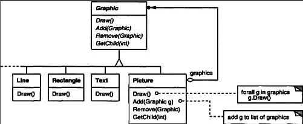
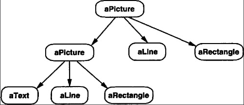
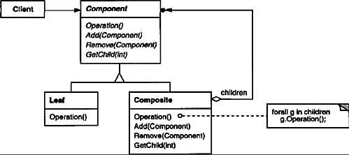
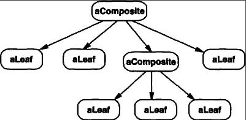

# Composite (Objetos Estructurales)

## Intención
Componer objetos dentro de estructuras de árbol para representar jerarquías de partes y totalidades. Composite permite a los clientes tratar objetos individuales y objetos de composición uniformemente.

## Motivación
Las aplicaciones gráficas como editores de dibujo y Sistemas de captura esquemática permiten a usuarios construir diagramas complejos a partir de componentes simples. El usuario puede agrupar componentes para formar componentes mas grandes. Una implementación simple puede ser definir clases para gráficos primitivos como un Texto y Lineas mas otras clases que actúan como contenedores para estos primitivos.

Pero existe un problema con este enfoque: El Código que utiliza estas clases debe tratar los objetos primitivos y contenedores de manera diferente, incluso si la mayor parte del tiempo el usuario los trata idénticamente. Tener que distinguir estos objetos hace la aplicación mas compleja.  El patrón composite describe como usar composición recursiva  para que el cliente no tenga que hacer esta distinción.



La clave del patrón composite es una clase abstracta que representa ambas, primitivas y sus contenedores. Para el sistema gráfico, esta clase es `Graphic`. `Graphic` declara operaciones como `Draw` que son especificas para objetos gráficos. También declara operaciones que todos los objetos compuestos comparten, como operaciones para acceder  y gestionar su hijos.

Las subclases `Line`,`Rectangle`, y `Text`(ver próximo diagram de clases) definen objetos gráficos primitivos. Estas clases implementan `Draw` para dibujar lineas, rectángulos, y texto, respectivamente. Ya que los gráficos primitivos no tienen hijos gráficos, ninguna de estas subclases implementa operaciones relacionadas a hijos.

La clase `Picture` define un conjunto de objetos gráficos. Picture implementa `Draw` para llamar `Draw` a sus hijos, y esta implementa acordemente operaciones de relación de hijos. Ya que la interface `Picture` conforma la interface `Graphic`, los objetos `Picture` pueden componer otros Pictures de forma recursiva.

El siguiente diagrama muestra una típica estructura de un objeto compuesto de objetos gráficos compuestos.



## Aplicabilidad
Usar el patrón composite cuando
* Se desea representar jerarquías de partes y conjuntos de objetos.
* Se desea que los clientes puedan ignorar las diferentes composiciones de objetos y objetos individuales. Los clientes van a tratar todos los objetos en las estructuras compuestas uniformemente.

## Estructura


Un objeto `Composite` típico puede verse así:


## Participantes

* **Component**(Graphic)
  - declara la interface para los objetos en la composición.
  - implementa comportamientos por defecto para la interface en común de todas las clases, según corresponda.
  - declara una interface para acceder y gestionar sus componentes hijos.
  - (opcional) define una interface para acceder a componentes padres en la estructura recursiva, e implementa es si es apropiado.

* **Leaf** (Rectangle, Line, Text, etc.)
  - representa objetos hoja en la composición. Un objeto Hoja no tiene hijos.
  - define el comportamiento para objetos primitivos en la composición.
* **Composite** (Picture)
  - define el comportamiento para componentes que tienen hijos.
  - almacena los componentes hijos.
  - implementa operaciones de relación-hijos en la interface del Componente.
* **Client**
  - manipula objetos en la composición a través de la interface del Componente.

## Colaboraciones

* Los clientes usan interface de clase `Component` pra interactuar con objetos en la estructura. Si el recipiente es un `Leaf`, entonces la solicitud es manejada directamente. Si el recipiente es un `Composite`, dirige las solicitudes a sus hijos, posiblemente ejecutando operaciones adicionales antes y después de dirigir.

## Consecuencias
El patrón Composite

* define jerarquía de clases que consisten de objetos primitivos y objetos compuestos. Los objetos primitivos pueden estar compuestos de mas objetos complejos, lo cual a su vez puede estar compuesto, y así sucesivamente. Donde sea que el código del cliente espere un objeto primitivo, este puede también tomar un objeto compuesto.  
* hace simple al cliente. Los clientes pueden tratar estructuras compuestas y objetos individuales uniformemente. Los clientes no saben (y no debería importar) si están transaccionando con un componente `Leaf` o `Composite`.
* hace fácil agregar nuevos tipos de componentes. Una vez definidos Composite o subclases de Leaf trabajaran automáticamente con estructuras existentes y código del cliente. Los clientes no tiene que cambiar debido a nuevas clases de componentes.
* puede hacer que el diseño sea demasiado general. La desventaja de hacer fácil de agregar nuevos componentes es que hace difícil restringir los componentes de un composite. Algunas veces se quiere que un composite tenga solo ciertos componentes. Con composite, no se puede depender del sistema de tipos para hacer cumplir esas restricciones. Se deben verificar en run-time en su lugar.

## Implementación
Existen muchos errores a considerar cuando implementamos el patrón composite:

1. *Referencias de padres explícitos*. Mantener referencias en componentes hijos de sus padres puede simplificar la travesía y la gestión de una estructura compuesta. La referencia del padre simplifica ascender en la estructura y borrar un componente. Las referencias de padre también ayudan a soportar el patrón de Cadena de Responsabilidad.

El lugar usual para definir la referencia de padre es en la clase Component. Las clases de hoja o compuestas puede heredar la referencia y las operaciones que gestionan esa referencia.

Con referencias a padres, es esencial mantener la invariante de que todos los hijos de un composite tienen como su padre el composite que a su vez los contiene como hijos. La forma más fácil de garantizar esto es cambiar el padre de un componente solo cuando se está agregando o eliminando del composite. Si esto puede implementarse una vez en las operaciones de `Add` y `Remove` de la clase Composite, entonces podrá ser heredado por todas las subclases y la invariante se mantendrá automáticamente.

2. *Compartir componentes*. Es usualmente útil compartir componente, por ejemplo, para reducir requisitos de almacenamiento. Pero cuando un componente puede tener mas de un padre, compartir componentes resulta difícil.

Una posible solución es para un hijo almacenar multiples padres. Pero esto puede generar ambigüedades a medida que una solicitud se propaga hacia arriba en la estructura. El patrón FlyWeight muestra cómo reestructurar un diseño para evitar almacenar padres juntos. Esto funciona en casos donde los hijos pueden evitar enviar solicitudes al padre externalizando una parte o todos su estado.

3.  *Maximizar la interface del Componente*. Una de las metas del patrón Composite es hacer que los clientes se olviden de las clases específicas de `Leaf` o `Composite` que están usando. Para lograr esta meta, la clase `Component` en lo posible debe definir  tantas operaciones comunes como sea posible para los objetos `Composite` y `Leaf`. La clase Componente usualmente provee implementaciones por defecto para estas operaciones, y las subclases de hoja o compuestas las sobrescriben-anulan. 

Sin embargo, esta meta entrará en conflicto con el principio de diseño de jerarquía de clases que dice "una clase debe solo definir operaciones que son significativas para sus subclases". Existen muchas operaciones que un componente soporta  que no tiene sentido para las clases `Leaf`. ¿Cómo puede `Component` proveer un implementación por defecto para ellas?.

Algunas veces un poco de creatividad muestra cómo una operación que podría tener sentido solo para Composites puede ser implementada para todos los componentes moviendo esta a la clase Component. Por ejemplo, la interface para acceder a los hijos es una parte fundamental de una clase compuesta pero no necesariamente para las clases hoja. pero si vemos una `Leaf` como un componente que nunca tiene hijos, luego podemos definir una operación para acceder  a los hijos en la clase `Component` como que nunca retorne hijos. las clases `Leaf` pueden usar la implementación por defecto, pero las clases Composite van a re-implementarla para retornar sus hijos.

La gestión de operaciones de hijos son mas problemáticas y discutidas en el siguiente item.

4. *Declarar las operaciones de gestión de hijos*. Aunque la clase `Composite` implementa las operaciones `Add` y `Remove` para gestionar hijos, un problema importante en el patrón composite son aquellas clases que declaran estas operaciones en la jerarquía de la clase `Composite`. ¿Debemos declarar y definir estas operaciones en `Component` y hacerlas significativas par las clases `Leaf`, o las debemos declarar y definir en `Composite` y sus subclases?.

La decisión envuelve un compromiso entre seguridad y transparencia:
* Definir la interface de gestión de hijos en la raíz de la jerarquía de clases nos da transparencia, porque podemos tratar todos los componentes uniformemente. No obstante a costa de seguridad, porque los clientes podrían tratar de hacer cosas sin sentido como agregar y remover objetos de hojas.
* Definir la gestión de hijos en la clase `Composite` da seguridad, porque cualquier intento de agregar o remover objetos de hojas será capturado en tiempo de compilación en un lenguaje de tipo estático como C++. Pero se perderá transparencia, porque las hojas y compuestos tienen interfaces distintas.

En este patrón se enfatizó transparencia sobre seguridad, si optamos por seguridad, luego en ocasiones podría perder información de tipo y tener que convertir un componente en un compuesto. ¿Cómo puedes hacer esto sin recurrir a una conversión sin tipo seguro?

Un enfoque es declarar una operación `Composite* GetComposite()` en la clase `Component`. el componente provee una operación por defecto que retorna un null pointer. La clase `Composite` redefine esta operación para retornarse a si misma:

```swift
class Component {
    func getComposite() -> Composite? {
        return nil
    }
    
    func add(component: Component) {
        // do nothing by default
    }
    
    func remove(component: Component) {
        // do nothing by default
    }
}

class Composite: Component {
    
    override func getComposite() -> Composite? {
        return self
    }
    
    override func add(component: Component) {
        // add implementation
    }    
}
```

GetComposite nos permite consultar por un componente y ver is es un compuesto. Podemos ejecutar `Add` y `Remove` de forma segura sobre el componente que retorna.

```swift
var aComposite = Composite()
var aLeaf = Leaf()

var aComponent:Component = aComposite
if let test = aComponent.getComposite() {
    test.add(component: Leaf())
}

aComponent = aLeaf
if let test = aComponent.getComposite() {
    test.add(component: Leaf()) // will no add Leaf
}
```

Tests similares para un `Composite` pueden realizarse usando la construcción `dynamic_cast` en C++.

Sin embargo, ahí existe el problema de que no estamos tratando todos los componentes uniformemente. tenemos que revertir para hacer test de diferentes tipos antes de la acción apropiada.

La única manera de proveer transparencia es definir un comportamiento por defecto para las operaciones `Add` y `Remove` en `Componente`. Esto crea un nuevo problema: No hay manera de implementar `Component::Add` sin introducir la posibilidad de fallo. Podríamos hacer que haga nada, pero esto ignoraría una consideración importante; que es, * un intento de add algo a una hoja probablemente indica un bug*, en este caso, la operación `Add` produce basura. Podríamos hacer que elimine su argumento, pero esto podría no ser lo que esperan los clientes.

Usualmente es mejor hacer que fallen `Add` y `Remove` por defecto (quizás levantando una excepción) si el componente no tiene permitido tener hijos o si el argumento de `Remove` no es un hijo de `Component`, respectivamente.

Otra alternativa es cambiar el significado de "remove" levemente. Si el componente mantiene un referencia de padre, luego podríamos redefinir `Component::Remove` para removerse a si mismo de su padre. Sin embargo, aún no hay una interpretación significativa para una adición correspondiente.

5. *¿Debería `Component` implementar una lista de Componentes?*. Puede que nos sintamos tentados a definir un conjunto de hijos como una variable de instancia en la clase `Component` donde el acceso a hijos y las operaciones de gestión son declarados. Pero poniendo el puntero de objeto en la clase base incurre en una penalización de espacio por cada hoja, inclusive aunque una Leaf nunca tenga hijos. Esto vale la pena solo si hay relativamente pocos hijos en la estructura.

6. *Ordenado de hijos*. Muchos diseños especifican un ordenado de hijos en el compuesto. En el ejemplo temprano de `Graphics`, el ordenamiento puede reflejar un orden de adelante hacia atrás, Si Composites representa arboles de análisis, luego sentencias compuestas  pueden ser instances de un Composite cuyos hijos deben estar ordenados para reflejar el programa.

Cuando el ordenado de hijos es un error, se debe diseñar  una interface de acceso a hijos y gestión cuidadosamente para gestionar la secuencia de hijos. El patron Iterator puede guiarnos en esto.

7. *Cachear para mejorar rendimiento* Si necesitamos recorrer o buscar composiciones frecuentemente, la clase `Composite` puede cachear recorridos o información de búsqueda acerca de sus hijos. la `Composite`  puede caches resultados actuales o solo información que le permita realizar un atajo en el recorrido o búsqueda. Por ejemplo, la clase `Picture` del ejemplo Motivation puede cachear la caja delimitadora(bounding box) de sus hijos. Durante el dibujado o selección, este caché de la caja delimitadora  permite a `Picture` evitar dibujar o buscar cuando sus hijos no son visible en la ventana actual.

Los Cambios en un componente requerirán invalidar el cache de sus padres. Esto funciona mejor cuando los componentes conocen sus padres. Entonces si estas usando cacheo, se necesita definir una interface par decirle a los composites que sus caches son inválidos.

8. *¿Quién debe eliminar los componentes?* En lenguajes sin garbage collection, es usualmente mejor hacer a Composite responsable de eliminar sus hijos cuando es destruido. Una excepción a esta regla es cuando los objetos `Leaf` son inmutables o estos son compartidos.
9. *¿Cuál es la mejor estructura de datos para almacenar componentes?* Composites puede usar una variedad de estructura de datos  para almacenar sus hijos, incluyendo linked lists, trees, arrays, y hash tables. La elección de estructura de datos depende(como siempre) en eficiencia. En realidad, incluso no es necesario data structures para un uso de propósito general. Algunas veces composites tiene una variable para cada hijo, aunque esto requiere que cada subclase de Composite implemente su propia interfaz de gestión. Ver Interpreter para un ejemplo.

## Código de Ejemplo
Equipamiento como computadores y componentes stereo con frecuencia se organizan en jerarquías de part-whole o de contención". Por ejemplo, un chasis puede puede contener unidades de almacenamiento y placas planares, un bus puede contener tarjetas, y un gabinete puede contener un chasis, buses, y así sucesivamente. Como las estructuras pueden ser modeladas naturalmente won el patrón composite.

la clase `Equipment` define una interface para todo el equipamiento en la jerarquía part-whole.
```swift 
class Equipment {
    
    fileprivate var name:String
    init(name:String) {
        self.name = name
    }
    
    func power() -> Watt? { nil }
    func netPrice() -> Currency? { nil }
    func discountPrice() -> Currency? { nil }
    func add(_ e: Equipment) { }
    func remove(_ e: Equipment) { }
    func createIterator() -> [Equipment] { [] }
}
```
`Equipment` declara operaciones que retornan atributos para una pieza de equipo, como su consumo de energía  y costo. Las subclases implementan estas operaciones para específicos tipos de equipamiento. `Equipment` también declara una operación `CreateIterator` que retorna un `Iterator` para acceder a sus partes. La implementación por defecto retorna un NullIterator, el cual itera sobre un conjunto vacío.

Las subclases de `Equipment` podrían incluir clases `Leaf` que representan discos duros, circuitos integrados, y switches:

```swift
class FloppyDisk: Equipment {
    
    override init(name: String) {
        super.init(name: name)
    }
    
    override func power() -> Watt {
        return Watt(value: 1)
    }
    
    override func netPrice() -> Currency {
        return Currency(price: 10.0)
    }
    
    override func discountPrice() -> Currency {
        return Currency(price: 8.99)
    }
}
```

`CompositeEquipment` es la clase base para equipment que contienen otros equipment, es también una subclase de `Equipment`.

```swift
class CompositeEquipment: Equipment {
    var equipment:[Equipment]
    
    override init(name: String) {
        equipment = []
        super.init(name: name)
    }
    
    override func power() -> Watt? {
        super.power()
    }
    
    override func netPrice() -> Currency? {
        super.netPrice()
    }
    
    override func discountPrice() -> Currency? {
        super.netPrice()
    }
    
    override func add(_ e: Equipment) {
        super.add(e)
    }
    
    override func remove(_ e: Equipment) {
        super.remove(e)
    }
    
    override func createIterator() -> [Equipment] {
        super.createIterator()
    }
}

```
`CompositeEquipment` define las operaciones para acceder y gestionar sub equipos. Las operaciones `Add` y `Remove` insertan y eliminan desde el listado de equipment almacenado en la variable miembro. La operación `CreateIterator` retorna un iterator (específicamente, una instancia de `ListIterator`) que recorre esta lista.

Una implementación por defecto de `NetPrice` podría usar `CreateIterator` para sumar los precios netos de sub equipamientos:

```swift
override func netPrice() -> Currency? {
    var total:Float = 0
    for equipment in createIterator() {
        if let price = equipment.netPrice()?.price {
            total += price
        }
    }
    
    return Currency(price: total)
}
```

Ahora podemos representar un chasis de computadora como una subclase de `CompositeEquipment` llamada `Chassis`. `Chassis` hereda las operaciones de relación de hijos de `CompositeEquipment`.
```swift
class Chassis: CompositeEquipment {
    override func power() -> Watt? {
        Watt(value: 10)
    }
    
    override func discountPrice() -> Currency? {
        Currency(price: 90)
    }
}
```
Podemos definir otros contenedores como `Cabinet` y `Bus` de la misma forma. Esto nos proporciona todo lo que necesitamos  para ensamblar equipo dentro de un (bastante simple) computador personal.
```swift
let cabinet = Cabinet(name: "PC Cabinet")
let chassis = Chassis(name: "PC Chassis")

cabinet.add(chassis)

let bus = Bus(name: "MCA Bus")
bus.add(Card(name:"16 Mbs Token Ring"))

chassis.add(bus)
chassis.add(FloppyDisk(name: "3.5in Floppy"))

print("the net price is \(String(describing: chassis.netPrice()))")
```

## Usos conocidos
Ejemplos del patrón Composite pueden encontrarse en casi todos los sistemas orientados a objetos. La clase original de Smalltalk Model/View/Controller fun un Composite, y casi cada herramienta de interface de usuario o framework ha seguido estos pasos, incluido ET++ (con sus VObjects) y entrevistas (Estilos, Gráficos y Glifos). Es interesante notar que la vista original de Model/View/Controller tenia un conjunto de sub vistas; en otras palabras, `View` fue ambas la clase Component y la clase Composite, la versión 4.0 de Smalltalk-80 revisada del Modelo/Vista/Controlador con una clase VisualComponent que tiene subclases View y CompositeView.

El framework compilador RTL de Smalltalk usa el patrón composite extensivamente. RTLExpression es una clase Component para parsear árboles. Esta tiene subclases, tales como `BinaryExpression`, que contienen objetos hijos `RTLExpression`. Estas clases definen una estructura composite para parsear árboles. `RegisterTransfer` es la clase Component para la forma intermedia de Asignación Única Estática (SSA) de un programa." Leaf subclases de `RegisterTransfer` definen diferentes asignaciones estáticas como:

* asignación primitiva que ejecuta una operación sobre dos registros y asigna el resultado a un tercero.
* una asignación con un registro de origen pero sin un registro de destino, lo que indica que el registro se utiliza después de que una rutina haya retornado.
* una asignación con un registro de destino pero no origen, lo cual indica que el registro es asignado antes de que la rutina haya iniciado.

Otras subclases, RegisterTransferSet, es una clase Composite para representar asignaciones que cambian varios registros a la vez.
Otro ejemplo de este patron ocurre en el ámbito financiero, donde un portafolio agrega activos individuales. Podemos soportar agrupaciones complejas de activos implementando un portafolio como un Composite que conforma la interface de un activo individual.

El patrón Command describe cómo los objetos Command pueden ser compuestos y secuenciados con una clase compuesta MacroCommand.

## Patrones Relacionados
Con frecuencia, el link component-parent se utiliza para una Cadena de Responsabilidad.

El Decorator frecuentemente es usado con Composite. Cuando decoradores y compuestos son usados juntos, usualmente tendrán  una clase padre en común. Entonces decorators tendrán que soportar la interface Component con operaciones como  Add, Remove, GetChild.

El Flyweight permite compartir componentes, pero ya no pueden referenciar sus padres.

El Iterator puede ser usado para recorrer composites.

El Visitor localiza operaciones y comportamientos que de otra manera estarían distribuidos entre las clases Composite y Leaf.

  