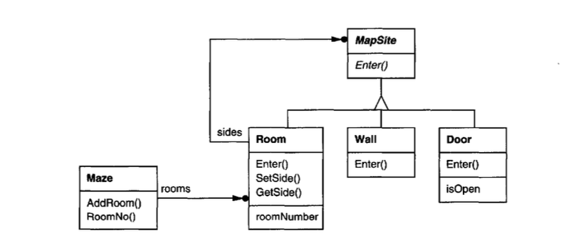

# Patrones de diseño de Creación

Los patrones de diseño de creación abstraen el proceso de instancia, ayudan al sistema de ser independiente de como sus objetos son creados, compuestos, y representados. Un patrón  de creación de clases utiliza al herencia para variar la clase de a que se crea una instancia, mientras que un patrón de creación de objetos delegará lal creación a otro objeto.

Los patrones de creación comienzan a ser importantes a medida que el sistema evoluciona para depender mas de composición de objetos que de herencia de clases.

Hay dos temas recurrentes en estos patrones. Primero, todos ellos encapsulan el conocimiento acerca de cuales clases en concreto el sistema usa. Segundo, ocultan el cómo las instancias de  esas clases son creadas y combinadas. 

Algunas veces los patrones de creación son competidores. Por ejemplo, hay casos donde se puede escoger entre Prototype o AbstractFactory. En otros casos pueden complementarse: Builder puede usar uno de los otros patrones para implementar qué componentes se construyen. Prototype puede usar singleton en su implementación.

Ya que los patrones de creación están estrechamente relacionados, en este libro se estudiaron 5 de ellos juntos para resaltar sus similitudes y diferencias, se usa un ejemplo común. Construyendo un Laberinto(Maze) para un juego de computadora y así ilustrar sus implementaciones. El laberinto va a variar significativamente de patrón a patrón. A veces el juego consistirá simplemente en encontrar la salida de un laberinto; en ese caso el jugador probablemente solo tiene un vista local del laberinto. A veces los laberintos contienen problemas a solucionar y peligros a superar, y estos juegos pueden proporcionar un mapa de la parte del laberinto que ha sido explorada.

**Se ignorará** muchos detalles de que puede hacer un laberinto y si un juego de laberinto tiene uno o multiples jugadores. En su lugar el foco será **el cómo los laberintos son creados**.

El siguiente diagrama muestra las relaciones entre las clases.



## Práctica en Swift
He tratado de replicar de la mejor forma este ejemplo a código Swift, a continuación listo las clases con una breve explicación de responsabilidades:

```swift
/**
    `MapSite` es la clase abstracta en común para todos los componentes del laberinto.
*/
class MapSite {
    /// Enter es la operación en común entre componentes,
    /// el significado de esta operación depende del componente al que entres.
    ///
    /// - Parameter player: este objeto es tomado como argumento para definir si cambia su estado.
    func enter(player: Player) {}
}
```

```swift
/**
    `Room` define las relaciones claves entre componentes del laberinto
    Mantiene referencias de otros MapSite y almacena el número de habitación.
*/
class Room: MapSite {
    let roomNo: Int
    var sides:[Direction:MapSite] = [:]

    init(roomNo: Int) {
        self.roomNo = roomNo
    }
    
    func getSide(direction: Direction) -> MapSite? {
        return sides[direction]
    }
    
    func setSide(direction: Direction, site: MapSite) {
        sides[direction] = site
    }
    
    override func enter(player:Player) {
        player.location = self
    }   
}
```

```swift
/**
    Las siguientes clases representan la Pared y Puerta que se presentan a cada lado
    de una habitación.
*/
class Wall: MapSite {
    
    override func enter(player:Player) {
        player.hurtNoseCount += 1
    }
}

class Door: MapSite {
    private let room1:Room
    private let room2:Room
    private(set) var isOpen:Bool = false

    init(room1: Room, room2:Room) {
        self.room1 = room1
        self.room2 = room2
    }
    
    func otherSideFrom(room: Room) -> Room {
        return (room === room1) ? room2 : room1
    }
    
    override func enter(player:Player) {
        guard isOpen else {
            player.hurtNoseCount += 1
            return
        }
       
        if let location = player.location {
            otherSideFrom(room: location)
                .enter(player: player)
        }
    }
    
    func open() {
        isOpen = true
    }
}
```

```swift
/**
    `Maze` representa la colección de habitaciones, también puede encontrar
    una habitación particular mediante un dado número de habitación.
*/
class Maze {
    
    private var rooms:[Room] = []
    
    func room(roomNumber: Int) -> Room? {
        return rooms.first{ $0.roomNo == roomNumber }
    }
    
    func addRoom(room:Room) {
        rooms.append(room)
    }
}
```

```swift
/**
    `MazeGame` crea el laberinto
    Una forma sencilla de crear un laberinto es con una serie de operaciones que agregan componentes
    al laberinto y luego los inter conectan. Por ejemplo, la siguiente función miembro creará un laberinto
    que consta de dos habitaciones con una puerta entre ellas.
*/
class MazeGame {

 func createMaze() -> Maze {
        let aMaze = Maze()
        let r1 = Room(roomNo: 1)
        let r2 = Room(roomNo: 2)
        let theDoor = Door(room1: r1, room2: r2)
        
        aMaze.addRoom(room: r1)
        aMaze.addRoom(room: r2)
        
        r1.setSide(direction: .north, site: Wall())
        r1.setSide(direction: .east, site: theDoor)
        r1.setSide(direction: .south, site: Wall())
        r1.setSide(direction: .west, site: Wall())
        
        r2.setSide(direction: .north, site: Wall())
        r2.setSide(direction: .east, site: Wall())
        r2.setSide(direction: .south, site: Wall())
        r2.setSide(direction: .west, site: theDoor)

        return aMaze
    }
...
}
```

El código anterior será la base para aplicar los siguientes ejemplos de patrones de creación, como se evidencia en la función de miembro `createMaze` es algo complicada y simplemente se están creando dos habitaciones. Existen formas de hacerlo mas simple. Por ejemplo, el constructor de `Room` podría inicializar sus lados al recibirlos por parámetro. Pero esto solo hace que movamos el código en algún otro lugar. El problema real con esta función no es el tamaño pero si su *inflexibilidad*. Esta función acopla el diseño del laberinto. Cambiar el diseño del laberinto implica cambiar esta función, ya sea por anulación puesto que implica re implementar todo o cambiando sus partes, lo cual es propenso a errores y no promueve su reutilización.

Los patrones de creación muestran cómo hacer este diseño mas *flexible*, no necesariamente mas pequeño. En particular, nos hacen mas fácil cambiar las clases que definen los componentes de un laberinto.

Supongamos que queremos reutilizar un existente diseño de laberinto para un nuevo juego que contiene(entre todas las cosas) laberintos encantados. El juego de laberinto encantado tendría nuevos tipos de componentes, como `DoorNeedingSpell`, una puerta que puede cerrarse o abrirse netamente cuando se pronuncien las palabras mágicas. ¿Cómo se puede cambiar la función de miembro `createMaze` fácilmente para que cree laberintos para este nuevo tipo clases?.

En este caso, la mas grande barrera son las clases quemadas al llamar su instancia. Los patrones de creación proveen diferentes formas de remover referencias explicitas de clases concretas desde código que necesita sus instancias.

* Si `createMaze` llama funciones virtuales(funciones abstractas) en lugar  de llamadas de constructor para crear las habitaciones, paredes, y puertas que requiere, luego se pueden cambiar las instancias de clases creando una subclase de `MazeGame` y redefiniendo estas funciones virtuales. Este enfoque es un ejemplo del patrón `Factory Method`.
* Si `createMaze` se le pasa un objeto como parámetro que usa para crear habitaciones, paredes y puertas, luego se pueden cambiar las clases de esas habitaciones, paredes y puertas pasando diferentes parámetros, Este es un ejemplo del patrón `Abstract Factory`.
* Si `createMaze` se le pasa un objeto que puede crear un un nuevo laberinto en su totalidad utilizando operaciones para agregar habitaciones, puertas y paredes al laberinto que construye, luego se puede usar herencia para cambiar las partes del laberinto o la forma que el laberinto se construye. Este es un ejemplo del patrón `Builder`.
* Si `createMaze` se parametriza a traves de objetos prototipo de habitaciones, puertas y paredes, las cuales luego copia y agrega al laberinto, luego se puede cambiar la composición del laberinto remplazando estos objetos prototipo con unos diferentes. Este es un ejemplo del patrón `Prototype`.

El patrón de creación restante, `Singleton`, se asegura que exista un solo laberinto por juego y todos los objetos del juego tienen acceso a el sin recurrir a variables globales o funciones. Singleton también lo hace mas fácil de extender o remplazar sin tocar código existente.

