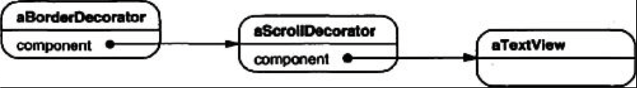
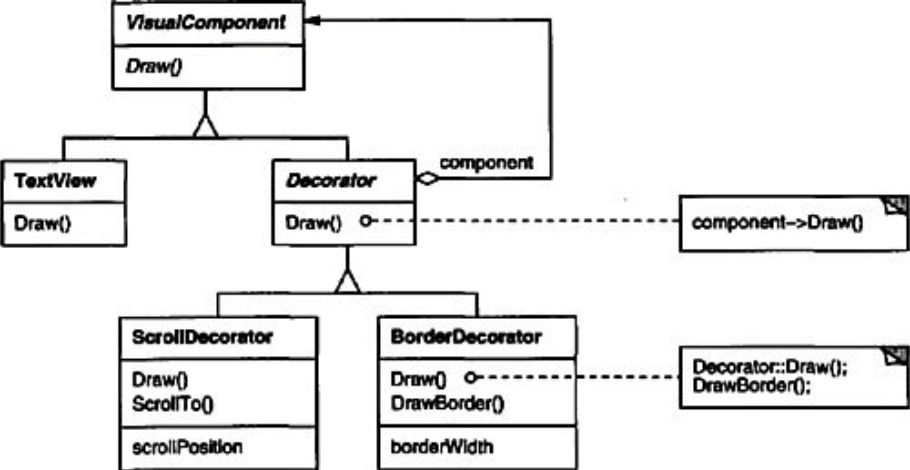
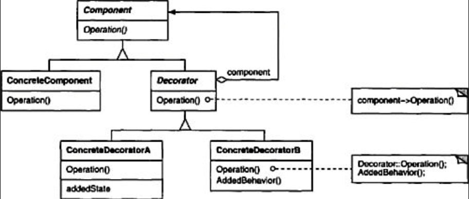

# Decorator (Objetos Estructurales)

# Intención
Agregar responsabilidades adicionales a un objeto de forma dinámica. Los decoradores proveen un alternativa flexible a subclassing para extender funcionalidad.

# También conocido como
Wrapper

# Motivación 
Algunas veces queremos agregar responsabilidades a objetos individuales, no a una clase entera. Una herramienta gráfica de interfaz de usuario, por ejemplo, debería permitir agregar propiedades como bordes o comportamientos a cualquier componente de la interfaz de usuario.

Un camino para agregar responsabilidades es co herencia. Heredando un borde de otra clase pone un borde alrededor de cada instancia de subclase. Sin embargo, esto es inflexible, porque la elección del borde está hecha de forma estática. Un cliente no puede controlar como y cuando decorar el componente con un borde.

Un enfoque mas flexible es encerrar el componente en otro objeto que agregue el borde. El objeto encerrador es llamado **decorador**. El decorador conforma la interface de el componente que decora entonces su presencia es transparente a los componentes del cliente. El decorador reenvía solicitudes a el componente y puede ejecutar acciones adicionales (Tales como dibujar un borde) antes o después de reenviar. La transparencia permite anidar decoradores de forma recursiva,  por lo tanto permitiendo un ilimitado numero de responsabilidades agregadas.

Por ejemplo, supongamos que tenemos un objeto TextView que muestra texto en una ventana. El TextView no tiene barras de scroll por defecto, porque no siempre podríamos necesitarlo. Cuando lo necesitemos, podemos usar un ScrollDecorator para agregarlo. Supongamos que también queremos agregar un borde ancho y negro al rededor del TextView. Podemos usar un BorderDecorator para agregarlo igualmente. Simplemente componemos los decoradores con el TextView para producir el resultado deseado.

El siguiente diagrama de objetos muestra como componer un objeto TextView con objetos BorderDecorator y ScrollDecorator para producir un TextView scrollable y bordado.

Las clases ScrollDecorator y BorderDecorator son subclasses de Decorator, un abstract class para componentes visuales que decoran otros componentes visuales.

VisualComponente es la clase abstracta para objetos visuales. Esta define su interface de dibujado y ejecución de eventos. Nótese como la clase Decorator simplemente reenvía solicitudes de dibujo a sus componentes, y como las subclases de Decorator pueden extender esta operación.

Las subclases de Decorator son libres de agregar operaciones para funcionalidades específicas. Por ejemplo, la operación ScrollTo de ScrollDecorator permite que otros objetos hagan desplazarse la interfaz si saben que hay un objeto ScrollDecorator presente en la interfaz. El aspecto importante de este patrón es que permite a los decorators aparecer donde sea que un componente visual pueda. De esta forma los clientes generalmente no pueden notar la diferencia entre un componente decorado y uno que no, por lo que no dependen en absoluto de la decoración.

# Aplicabilidad 
Usar Decorator
* para agregar responsabilidades a objetos individuales de forma dinámica y transparente, la cual es, sin afectar otros objetos.
* para responsabilidades que pueden ser retiradas.
* a veces la extensión mediante la subclase es impráctica. En ocasiones, puede haber un gran número de extensiones independientes posibles que generarían una explosión de subclases para soportar cada combinación. O la definición de una clase puede estar oculta o de otro modo no disponible para la sub clasificación.
  
# Estructura 

* **Component** (VisualComponent)
    - define la interface para objetos que pueden tener responsabilidades agregadas a ellos de forma dinámica.
* **ConcreteComponent** (TextView)
    - define un objeto al cual responsabilidades adicionales pueden ser agregadas.
* **Decorator**
    - mantiene una referencia a un objeto Componente y define una interfaz que se ajusta a la interfaz del Componente.
* **ConcreteDecorator** (BorderDecorator, ScrollDecorator)
    - agrega responsabilidades a el componente