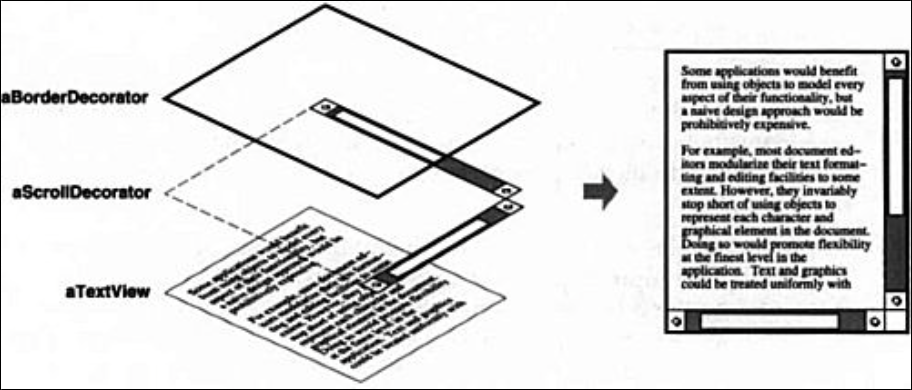

# Decorator (Objetos Estructurales)

## Intención
Agregar responsabilidades adicionales a un objeto de forma dinámica. Los decoradores proveen un alternativa flexible a subclassing para extender funcionalidad.

## También conocido como
Wrapper

## Motivación 
Algunas veces queremos agregar responsabilidades a objetos individuales, no a una clase entera. Una herramienta gráfica de interfaz de usuario, por ejemplo, debería permitir agregar propiedades como bordes o comportamientos a cualquier componente de la interfaz de usuario.

Un camino para agregar responsabilidades es co herencia. Heredando un borde de otra clase pone un borde alrededor de cada instancia de subclase. Sin embargo, esto es inflexible, porque la elección del borde está hecha de forma estática. Un cliente no puede controlar como y cuando decorar el componente con un borde.

Un enfoque mas flexible es encerrar el componente en otro objeto que agregue el borde. El objeto encerrador es llamado **decorador**. El decorador conforma la interface de el componente que decora entonces su presencia es transparente a los componentes del cliente. El decorador reenvía solicitudes a el componente y puede ejecutar acciones adicionales (Tales como dibujar un borde) antes o después de reenviar. La transparencia permite anidar decoradores de forma recursiva,  por lo tanto permitiendo un ilimitado numero de responsabilidades agregadas.



Por ejemplo, supongamos que tenemos un objeto TextView que muestra texto en una ventana. El TextView no tiene barras de scroll por defecto, porque no siempre podríamos necesitarlo. Cuando lo necesitemos, podemos usar un ScrollDecorator para agregarlo. Supongamos que también queremos agregar un borde ancho y negro al rededor del TextView. Podemos usar un BorderDecorator para agregarlo igualmente. Simplemente componemos los decoradores con el TextView para producir el resultado deseado.

El siguiente diagrama de objetos muestra como componer un objeto TextView con objetos BorderDecorator y ScrollDecorator para producir un TextView scrollable y bordado.


Las clases ScrollDecorator y BorderDecorator son subclasses de Decorator, un abstract class para componentes visuales que decoran otros componentes visuales.


VisualComponente es la clase abstracta para objetos visuales. Esta define su interface de dibujado y ejecución de eventos. Nótese como la clase Decorator simplemente reenvía solicitudes de dibujo a sus componentes, y como las subclases de Decorator pueden extender esta operación.

Las subclases de Decorator son libres de agregar operaciones para funcionalidades específicas. Por ejemplo, la operación ScrollTo de ScrollDecorator permite que otros objetos hagan desplazarse la interfaz si saben que hay un objeto ScrollDecorator presente en la interfaz. El aspecto importante de este patrón es que permite a los decorators aparecer donde sea que un componente visual pueda. De esta forma los clientes generalmente no pueden notar la diferencia entre un componente decorado y uno que no, por lo que no dependen en absoluto de la decoración.

## Aplicabilidad 
Usar Decorator
* para agregar responsabilidades a objetos individuales de forma dinámica y transparente, la cual es, sin afectar otros objetos.
* para responsabilidades que pueden ser retiradas.
* a veces la extensión mediante la subclase es impráctica. En ocasiones, puede haber un gran número de extensiones independientes posibles que generarían una explosión de subclases para soportar cada combinación. O la definición de una clase puede estar oculta o de otro modo no disponible para la sub clasificación.
  
## Estructura 


* **Component** (VisualComponent)
    - define la interface para objetos que pueden tener responsabilidades agregadas a ellos de forma dinámica.
* **ConcreteComponent** (TextView)
    - define un objeto al cual responsabilidades adicionales pueden ser agregadas.
* **Decorator**
    - mantiene una referencia a un objeto Componente y define una interfaz que se ajusta a la interfaz del Componente.
* **ConcreteDecorator** (BorderDecorator, ScrollDecorator)
    - agrega responsabilidades a el componente.

## Colaboraciones
* El Decorator reenvía solicitudes a su objeto Componente. Adicional puede ejecutar operaciones antes y después de reenviar la solicitud.

## Consecuencias
1. *Mas flexibilidad que herencia estática.* El patrón decorator provee un camino mas flexible para agregar responsabilidades a objetos que los que puede tener con herencia estática(multiple).
Con decoradores, responsabilidades pueden ser agregadas y removidas en tiempo de ejecución simplemente anexando o des anexando. En contraste, herencia requiere crear una nueva clase para cada responsabilidad adicional, (e.j BorderedScrollableTextView, BorderedTextView).
Esto da lugar a muchas clases e incrementa la complejidad  de un sistema. Ademas, proveer diferentes clases Decorator para un Componente especifico permite mezclar y emparejar responsabilidades.</br>
Los Decoradores también  hacen fácil agregar una propiedad dos veces. Por ejemplo, darle a un TexView un borde doble, simplemente anexando dos BorderDecorators. Heredar dos veces de una clase Border es propenso a errores, en el mejor de los casos.

2. *Evita clases sobrecargadas de funcionalidades en lo más alto de la jerarquía.* Decorator ofrece un enfoque pay-as-you-go para agregar responsabilidades. En lugar de intentar soportar todos las características posibles en un compleja, clase personalizable, se puede definir una clase simple y agregar funcionalidad incremental con objetos Decorator. La Funcionalidad puede ser compuesta de piezas simples. Como resultado, una aplicación no necesita pagar por características que no usa. Es también fácil de definir nuevos tipos de colaboradores independientemente de las clases de objetos que extienden, incluso para extensiones imprevistas. Extender una clase compleja tiende a exponer detalles no relacionados a las responsabilidades que se están agregando.

3. *Mantener clases Componente liviana.* para asegurar una conformación de interface, los componentes y decoradores deben descender de una clase común Component, es importante mantener esta clase común liviana; ya que, esta debe enfocarse en definir una interface, no en almacenar data. La definición de la representación de Data debe ser delegado a las subclases; de otra forma la complejidad de la clase Component podría hacer los decoradores muy pesados de usar en cantidad. Poner mucha funcionalidad en Component también incrementa la probabilidad de que las subclases paguen por features que no necesitan.
4. *Cambiar la apariencia externa de un objeto versus cambiar su estructura interna.* Podemos pensar un decorador como una skin sobrepuesta a un objeto que cambia su comportamiento. Una alternativa es cambiar la estructura interna del objeto. El patrón strategy es buen ejemplo de un patrón para cambiar estructuras.<br>
Las estrategias son mejores elecciones en situaciones donde la clase componente es intrínsecamente pesado, de ese modo hace el patrón Decorator muy costoso de aplicar. En el patrón Strategy, el componente reenvía algunos de sus comportamientos en objetos separados.
El patrón Strategy  permite alterar o extender las funcionalidades de los componentes mediante el remplazo del objeto strategy.
Por ejemplo, se puede soportar diferentes estilos de borde al posponer el dibujo del borde del componente en un objeto separado Border. El objeto Border es un objeto Strategy que encapsula una estrategia de dibujado de borde. Al ampliar el número de estrategias de solo una lista  a una sin límites, podemos lograr el efecto similar como los decoradores anidados de forma recursiva.<br>
En MacAp 3.0 y Bedrock, por ejemplo, componentes gráficos (llamados Views) mantienen una lista de objetos "adorner" que pueden anexar adornos adicionales como bordes  a una vista de componente. Si una vista  con adornos anexados cualesquiera, luego esta les da la oportunidad de dibujar adornos adicionales. MacApp y Bedrock deben usar este enfoque porque la clase Vista es pesada. Seria muy costoso usar una vista completa solo para añadir un borde.<br>
Ya que el patrón Decorador solo cambia un componente desde fuera, el componente no no sabe nada acerca de sus decoradores; es decir, los decorators son transparentes al componente:


Con estrategias, el componente en si mismo sabe acerca de posible extensiones. Entonces tiene que referenciar las estrategias correspondientes:


El enfoque basado en Strategy podría requerir modificar el componente para acomodar nuevas extensiones. En la otra mano, una estrategia puede tener su propia interface  especializada, al igual que la interface decorator debe conformar  la de componente. Una estrategia para mostrar un borde, por ejemplo, necesita definir la interface para cargar un borde (DrawBorder, GetWidth, etc), lo que significa que la estrategia puede ser liviana incluso si la clase Component es pesada.

Mac App y Bedrock usan este enfoque para mas que adornar vistas. También lo usan para aumentar el comportamiento de ejecución de eventos de objetos. En ambos sistemas, una vista mantiene una lista de objetos "comportamiento" que pueden modificar e interceptar eventos. La vista da a cada uno de los objetos de comportamiento registrados la oportunidad de manipular el evento antes no estar registrados los comportamientos, efectivamente mediante overriding. Se puede decorar una vista con soporte de manejo especial de teclado, por ejemplo, registrando un objeto behavior que intercepta y ejecuta eventos key.

## Código de ejemplo

El siguiente código muestra como implementar una decoradores de interface de usuario en C++. Asumamos que existe una clase Component llamada VisualComponent.

```cpp
class VisualComponent {
public:
    VisualComponent();

    virtual void Draw();
    virtual void Resize();
    // ...
}
```

Definamos una subclase de `VisualComponent` llamada `Decorator`, de la cual vamos a crear subclases para obtener diferentes decoraciones.

```cpp
class Decorator: public VisualComponent{
    Decorator(VisualComponent*);

    virtual void Draw();
    virtual void Resize();
    //...
private:
    VisualComponent* _component;
};
```
Decorator decora la referencia de VisualComponent mediante  la variable de instancia _component, la cual es inicializada en el constructor. Para cada operación en la interfaz de VisualComponent, Decorator define una implementación por defecto que pasa la solicitud al _component:

```cpp
void Decorator::Draw () {
    _component->Draw();
}

void Decorator::Resize () {
    _component->Resize();
}
```

Las subclases de `Decorator` definen decoraciones específicas. Por ejemplo, la clase `BorderDecorator`
agrega un borde a este encerrando el componente. `BorderDecorator` es una subclase de `Decorator` que sobrescribe la operación `Draw` para dibujar el borde. `BorderDecorator` también define una operación de ayuda `DrawBorder` privada que se encarga del dibujado. La subclase hereda todas las implementaciones de operaciones del `Decorator`.

```cpp
class BorderDecorator : public Decorator {
public:
    BorderDecorator(VisualComponent*, int borderWidth);

    virtual void Draw();
private:
    void DrawBorder(int);
private:
    int _width;
};

void BorderDecorator::Draw () {
    Decorator::Draw();
    DrawBorder(_width);
}
```

Una implementación similar se seguiría para `ScrollDecorator` y `DropShadowDecorator`, el cual agrega scroll y efecto de sombreado a un componente visual.

Ahora podemos componer instancias de estas clases para proveer diferentes decoraciones. El siguiente código ilustra como podemos usar decoradores para crear un `TextView` bordeado y scrollable.

Primero necesitamos un camino para poner un componente en un objeto de ventana. Asumamos que nuestra clase `Window` provee una operación `SetContents` para este propósito:

```cpp
void Window::SetContents (VisualComponent* contents) ,
    // ...
```
Ahora podemos crear el `TextView` y la `window` para ponerlos dentro:
```cpp
Window* window = new Window;
TextView* textView = new TextView;
```
`TextView` es un `VisualComponent`, lo que permite ponerlo dentro de una ventana:
```cpp
window->SetContents(textView);
```
Pero nosotros queremos un `TextView` bordeado y scrollable. Entonces lo decoramos acordemente antes de ponerlo en la ventana.

```cpp
window->SetContents(
    new BorderDecorator(
        new ScrollDecorator(textView), 1)
    )
);
```

Ya que `Window` acede a su contenido a traves de la interface del  `VisualComponent`, no es consciente de la presencia del decorador. Se puede rastrear el text view si se necesita interactuar con el directamente, por ejemplo, cuando se necesite invocar operaciones que no son parte de la interface  `VisualComponent`. Los clientes que dependen de la identidad del componente también deberían referirse a él directamente.

## Usos Conocidos
Muchas herramientas de interfaces de usuario que son object-oriented para agregar adornos a widgets. Ejemplos incluidos en entrevistas 


