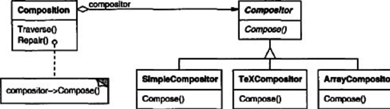
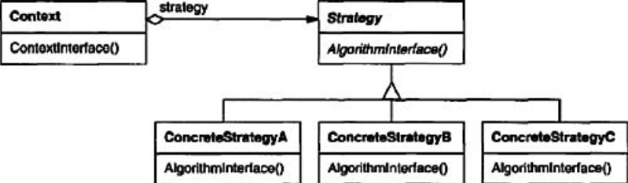

# Strategy (Objetos de comportamiento)

## Intención 
Define una familia de algoritmos, encapsula cada uno, y los hace intercambiables. Strategy permite al algoritmo variar independientemente de los clientes que lo usan.

## También conocido como
Policy

## Motivación
Muchos algoritmos existen para romper un transmisión de texto en lineas. No es deseable 'cablear directamente' todos esos algoritmos en las clases que los requieren por varias razones:
* Los clientes que necesitan line-breaking obtienen mas complejidad si incluyen el código de rompimiento de linea. Esto hace al cliente mas grande y difícil de mantener, especialmente si soporta multiples algoritmos para line-breaking.
* Diferentes algoritmos serán apropiados en ocasiones diferentes. No queremos soportar multiples algoritmos de line-breaking si no los usamos todos.
* Es difícil agregar nuevos algoritmos y variar los existentes cuando line-breaking es una parte integral del cliente.

Podemos evitar estos problemas definiendo clases que encapsulan diferentes algoritmos de line-breaking. Un algoritmo que es encapsulado de esta forma es llamado  **strategy**.

Supongamos una clase Composition que es responsable de mantener y actualizar line-breaks(saltos de linea) de texto desplegado en una vista de texto. Las estrategias de LineBreaking no son implementadas por la clase Composition. En su lugar, son implementadas separadamente en una subclass de la  clase abstracta Compositor. las subclases de Compositor implementan diferentes estrategias:

* **SimpleCompositor** implementa una estrategia simple que determina saltos de linea de uno a la vez.
* **TeXCompositor** implementa algoritmos TeX para encontrar saltos de linea. Esta estrategia intenta optimizar line-breaks globalmente, es decir, una párrafo a la vez.
* **ArrayCompositor** implementa una estrategia que selecciona saltos entonces cada row tiene un número fijo de items. Por ejemplo, esto es útil para romper una colección de icons en dos filas.

Una Composition mantiene una referencia de un objeto Compositor. Siempre que una Composition re formatee su texto, este reenvía esta responsabilidad a su objeto Compositor. El cliente de la Composition especifica cual Compositor debe ser usado para instalar el Compositor que desea dentro del Composition.

## Aplicabilidad
Usar el patrón Strategy cuando
* muchas clases relacionadas difieren solo en su comportamiento. Las estrategias proveen un camino para configurar una clase con uno o muchos comportamientos.
* se necesita diferentes variantes de un algoritmo. Por ejemplo, Podrías definir algoritmos que reflejen diferentes compensaciones entre espacio y tiempo. Las estrategias pueden ser usadas cuando estas variantes son implementadas como una jerarquía de clases de algoritmos.
* un algoritmo usa data que el cliente no debe conocer. Usar el patrón Strategy evita exponer lo complejo, estructuras de datos específicas del algoritmo.
* una clase define muchos comportamientos, y esto se resume en multiples sentencias condicionales en sus operaciones. En lugar de multiples condiciones, mover ramas de condiciones relacionadas dentro de su propia clase Strategy.

## Estructura

## Participantes
* **Strategy**(Compositor)
  - declara una interface común para todos los algoritmos soportados. Context usa esta interface para llamar el algoritmo definido por una ConcreteStrategy.
* **ConcreteStrategy**(SimpleCompositor, TeXCompositor, ArrayCompositor)
  - implementa el algoritmo usando la interface Strategy.
* **Context**(Composition)
  - es configurado con un objeto ConcreteStrategy.
  - mantiene una referencia de un objeto Strategy.
  - podría definir una interface que permita a la Strategy acceder a su data.

## Colaboraciones
* Strategy y Context interactúan para implementar el algoritmo seleccionado. Un context puede ser pasar toda la data requerida por el algoritmo a la estrategia cuando el algoritmo es llamado. Alternativamente, el context puede pasarse a si mismo  como un argumento para las operaciones de Strategy. Esto permite a la strategy llamar de vuelta sobre el contexto  como requerido.
* Un contexto reenvía solicitudes desde sus clientes a sus estrategias